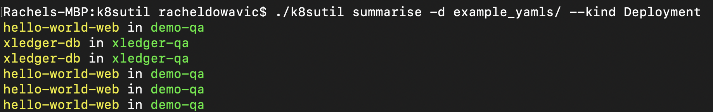

# k8sutil
This is a command line tool with subcommands for creating and interpreting kubernetes objects.

## How to use
1. Clone this repo
2. cd into the newly created k8sutil subdirectory
3. `go build`
4. Run `./k8sutil --help` to show the available subcommands

## Available Subcommands
## `k8sutil get-context`
### Easily display the current context, namespace, cluster, and user configured by your kube config 
It's assumed that you've set the path with `KUBECONFIG`, otherwise the tool will default to looking in `~/.kube/config`.

## `k8sutil workon`
### Effortlessly switch between contexts and namespaces without ever directly modifying your kube config
You can use this tool to switch your current context to any context made available by your kube config, and at the same time decide which namespace to set for that context, without having to modify your config by hand. You're also guaranteed that the namespace you select is a valid choice. Each selection on the left window represents a valid context/namespace combination. This uses [go-fuzzyfinder](https://github.com/ktr0731/go-fuzzyfinder) as a frontend.

## `k8sutil summarise`
### Summarise remote or local kubernetes resource information
If you want to inspect the contents of a single yaml file or even a directory of yaml files without every actually opening them, use this tool to get easily readable coloured output with name, namespace, and kind information for each resource. Here's an example of a basic invocation of the command.

You can also group the resources by kind (`--group-by-kind`), show the filepath from which the resource originated (`--show-filepath`), and filter by kind (`--kind`).

You can also fetch resources in the cluster with `--remote`. For this, you need to specify a namespace. All the resources within that namespace will be displayed.

## `k8sutil lint`
### Lint YAML kubernetes resources for security vulnerabilities

Inspired by popular kubernetes [best practices](https://thenewstack.io/10-kubernetes-best-practices-you-can-easily-apply-to-your-clusters/), this tool aims to automate the process of identifying possible vulnerabilities in a kubernetes resource definition and suggests and/or applies possible fixes. As of now, you can fork the project and add your [own linting rules](utils/linting.md) if you want to extend the default functionality. Here's an example of the tool linting a Deployment definition for possible issues.

You can also get the tool to attempt to apply the fixes itself, instead doing it by hand. This is flushed to standard output by default, but you can specify `--fix-output` with a file or directory name to have the fixed versions saved directly onto disk.

If you're interested, here's [more detailed information](utils/linter_usage.md) on how to use the tool.

### Show Dependencies implied by YAML Kubernetes Resources
TODO: Documentation

### TODO (Future Work)
- The utils package is kind of a mess, want to make subdirectories based on each subcommand?
- I eventually want to make the linter extendable. You should be able to progamatically invoke it instead of just as a command-line tool, and you should be able to add your own custom requirements. I like this a lot because since my tool relies onfreehand boolean functions, your tests can literally be whatever you want. You aren't restricted to just set, equal, greaterthan field checks like in kube-lint. This would be really nice. There is a lot more flexibility with this. For example, you could check that a string field belongs to a collection of custom defined strings in your program. Maybe there's not much of a use case for it, but at least the option is there.
    - For this, I would need to finally resign myself to the fact that I will need different rule types for different resource type so I can defer the injection of the relevant resource. (Right now, when I instantiate a rule struct, I am relying on the fact that there is a resource pointer in scope, and this is just not flexible enough. I thought it was a cool idea at first, but I was a little bit wrong)
    - I can make separate types based on Resource type, eg DeploymentRule. It has a member function Condition with 1 `*appsv1.Deployment` parameter. Then from this, as soon as I get the reference to the deployment, I can create a Rule struct, so that all <Resource>rules will conform to the same structure and I can execute them all in one go and apply all the tests and fixes in a uniform way.
    - Would prefer to pull TypeMeta and ObjectMeta interface conformance tests right to the beginning when I first parse the yamls

