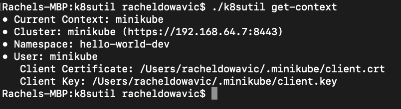
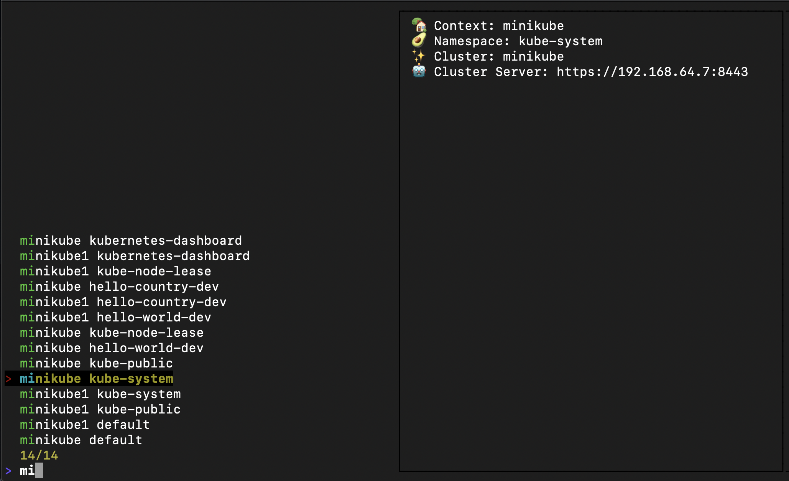
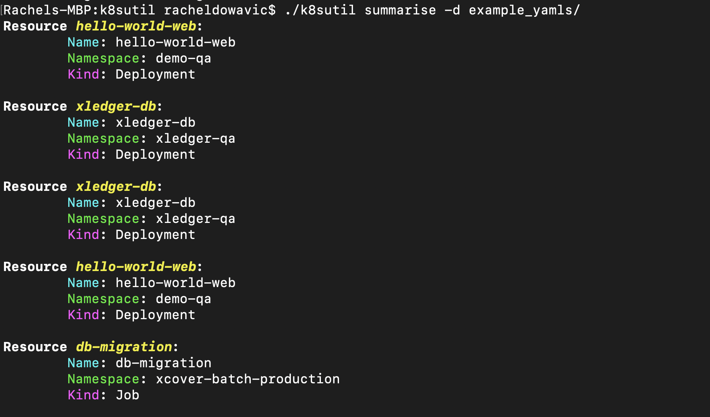
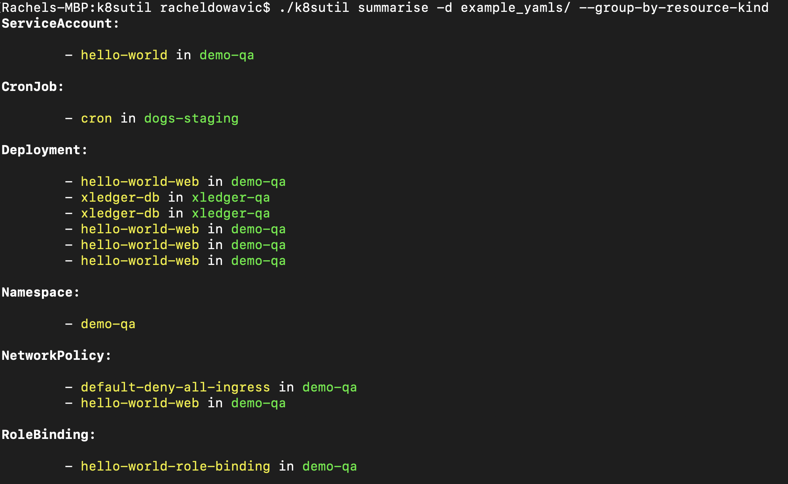
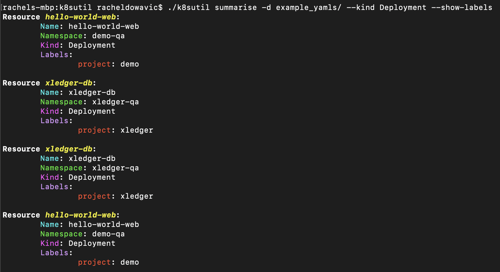
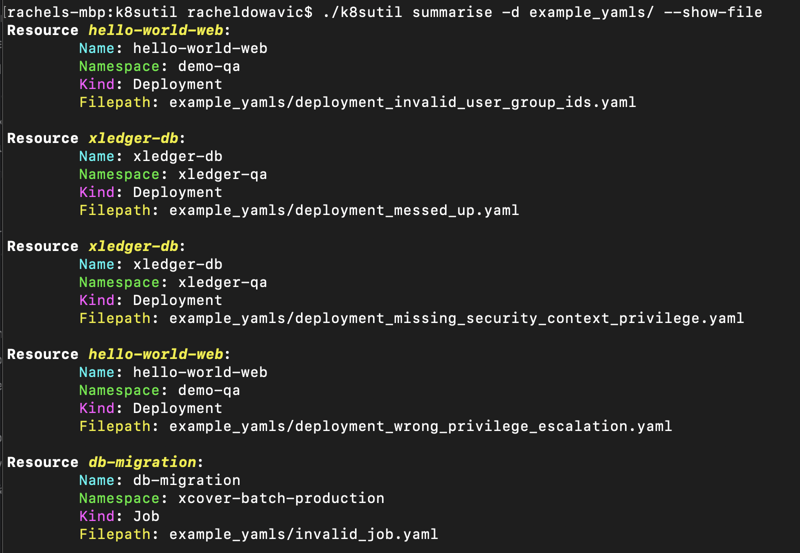
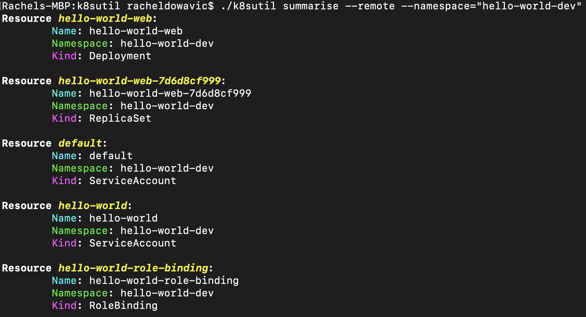
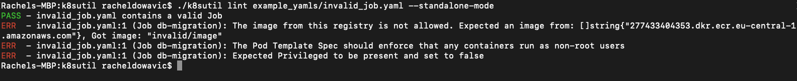
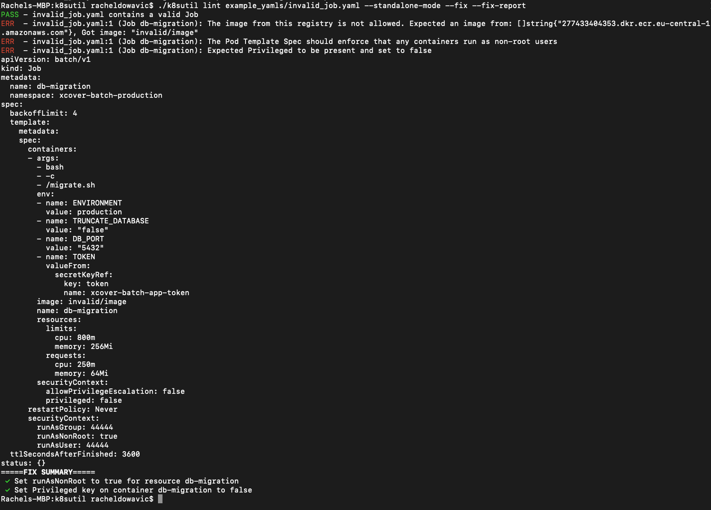
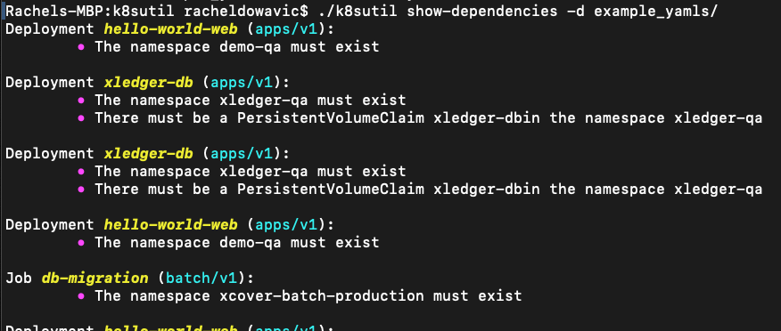

# k8sutil
This is a command line tool with subcommands for creating and interpreting kubernetes objects.

## How to use
1. Clone this repo
2. cd into the newly created k8sutil subdirectory
3. `go build`
4. Run `./k8sutil --help` to show the available subcommands

## Available Subcommands
## `k8sutil get-context`
### Easily display the current context, namespace, cluster, and user configured by your kube config 
It's assumed that you've set the path with `KUBECONFIG`, otherwise the tool will default to looking in `~/.kube/config`.

## `k8sutil workon`
### Effortlessly switch between contexts and namespaces without ever directly modifying your kube config
You can use this tool to switch your current context to any context made available by your kube config, and at the same time decide which namespace to set for that context, without having to modify your config by hand. You're also guaranteed that the namespace you select is a valid choice. Each selection on the left window represents a valid context/namespace combination. This uses [go-fuzzyfinder](https://github.com/ktr0731/go-fuzzyfinder) as a frontend.

#### Is there a benefit of this tool over `kubens` + `kubectx`?
`k8s workon` is similar to `kubectx`/`kubens` in that you can switch namespaces and contexts smoothly, but you also know exactly which contexts are available to switch between. And for each context, you are given a list of valid namespace choices, so you can't ever make a choice that doesn't make sense.

## `k8sutil summarise`
### Summarise remote or local kubernetes resource information
If you want to inspect the contents of a single yaml file or even a directory of yaml files without every actually opening them, use this tool to get easily readable coloured output with name, namespace, and kind information for each resource. Here's an example of a basic invocation of the command.

You can also filter by kind or namespace (`--kind`, `--namespace`), group by kind or label key (`--group-by-label`, `--group-by-kind`), and show the filepath from which the resource originated if you're scanning local resource configurations.

Otherwise, there's also the option to scan your cluster for resources with `--remote`.

#### Why not just use `kubectl get`?
`k8sutil summarise` is unlike `kubectl get` in that you won't need to necessarily specify a resource type to get (eg pod). By default, resources of any kind will be fetched. This way, you can view resources of any type within a namespace, or resources of any type in any namespace. You aren't forced to filter by type or namespace. The kubernetes API is built around the concept of segmenting resources by type and by namespace, so believe me, implementing this involved a lot of gross metaprogramming. Kubernetes never wanted this tool to be made, but here it is 🙃

## `k8sutil lint`
### Lint YAML kubernetes resources for security vulnerabilities

Inspired by popular kubernetes [best practices](https://thenewstack.io/10-kubernetes-best-practices-you-can-easily-apply-to-your-clusters/), this tool aims to automate the process of identifying possible vulnerabilities in a kubernetes resource definition and suggests and/or applies possible fixes. As of now, you can fork the project and add your [own linting rules](utils/linting.md) if you want to extend the default functionality. Here's an example of the tool linting a Deployment definition for possible issues.

You can also get the tool to attempt to apply the fixes itself, instead doing it by hand. This is flushed to standard output by default, but you can specify `--fix-output` with a file or directory name to have the fixed versions saved directly onto disk.

If you're interested, here's [more detailed information](utils/linter_usage.md) on how to use the tool.

#### Why this and not kube-score?
[kube-score](https://github.com/zegl/kube-score) is probably the most similar tool to `k8sutil lint` out there. What is most notable that I haven't seen replicated elsewhere is the possibility to automatically fix issues with the resource configurations so that easy fixes don't have to be performed by hand. I also think this tool is more open to extension since each rule is implemented declaratively rather than procedurally, and there is hope that in the future, client-specific kubernetes linting rules can easily be implemented by the client herself. Fingers crossed!

## `show-dependencies`
### Show Dependencies implied by YAML Kubernetes Resources
Sometimes a resource definition contains a reference to another kubernetes resource, implying that you think the other resource actually exists at all. This tool gives you a basic summary of the assumptions that your kubernetes resources are making. This way, you can ensure that those assumptions are met before you go ahead and apply to the cluster. See the [source ](utils/analyse_dependencies.go) for all the assumptions that are reported for each resource type.

#### Why use this? 
If you are interested in getting some level of static validation of your kubernetes object definitions locally before you apply to the cluster, this could be a nice helper. In general, I love tools that help you validate your code before you run it, and if you do too, I recommend this. It'll be much easier to catch typos that could end up leading to unexpected behaviour at the cluster level.

### TODO (Future Work)
- The utils package is kind of a mess, want to make subdirectories based on each subcommand?
- I eventually want to make the linter extendable. You should be able to progamatically invoke it instead of just as a command-line tool, and you should be able to add your own custom requirements. I like this a lot because since my tool relies onfreehand boolean functions, your tests can literally be whatever you want. You aren't restricted to just set, equal, greaterthan field checks like in kube-lint. This would be really nice. There is a lot more flexibility with this. For example, you could check that a string field belongs to a collection of custom defined strings in your program. Maybe there's not much of a use case for it, but at least the option is there.
    - For this, I would need to finally resign myself to the fact that I will need different rule types for different resource type so I can defer the injection of the relevant resource. (Right now, when I instantiate a rule struct, I am relying on the fact that there is a resource pointer in scope, and this is just not flexible enough. I thought it was a cool idea at first, but I was a little bit wrong)
    - I can make separate types based on Resource type, eg DeploymentRule. It has a member function Condition with 1 `*appsv1.Deployment` parameter. Then from this, as soon as I get the reference to the deployment, I can create a Rule struct, so that all <Resource>rules will conform to the same structure and I can execute them all in one go and apply all the tests and fixes in a uniform way.
    - Would prefer to pull TypeMeta and ObjectMeta interface conformance tests right to the beginning when I first parse the yamls

