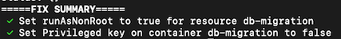

## How to use `k8sutil lint`

### Basic valid invocations
`k8sutil lint -d ~/yamls` <br>
`k8sutil lint my_deployment.yaml`

This is a reference for the command's usage.

```
Lint YAML file(s) against a set of predefined kubernetes best practices
Usage:
  k8sutil lint <filepath>* [flags]
Flags:
-d, --directories strings A comma-separated list of directories to recursively search for YAML documents
--fix apply fixes after identifying errors, where possible
-h, --help  help for lint-k8s
--fix-output string  output fixed yaml to file or folder instead of stdout
--standalone-mode Standalone mode - only run lint on the specified resources and skips any dependency checks
```

### `--standalone-mode`
The linter enforces both independent and interdependent rules, documented [here](linting.md). Sometimes you may want to ensure that all the given deployments and services are under the correct namespace, and this constitutes an interdependent rule. If you are just checking each resource one by one, for example, and you are not inputting an entire cohesive collection of kubernetes resources, you probably want to use this flag. This will make the linter forego any interdependent rule checking.

### `--fix`
Some tests, like checking if a key is present in a structure, can be automatically fixed by the linter by mutating the in-memory representation of the kubernetes resource. If you specify this flag, this means that all tests for which an automatic fix can be applied will be applied and the result will be output to stdout by default (use `--fix-output` if you want to change this behaviour). 
### `--fix-report`
This option just causes a list of the fixes applied to the resources to be output to stdout under the heading "FIX SUMMARY". This is so you can be aware of any side effects caused by the linter. The linter can never modify any file in-place, but at least you will know how the fixed output should differ from the source yaml.



### `--fix-output`
The argument for this flag can not only be a filepath, but it can also be a directory. In that case, the fixed `.yaml` filename will be based on the original `.yaml` filename with the suffix `.fixed` prepended to the `.yaml` extension. For example, if the file `deployment.yaml` is linted with `--fix-output` argument set to `myDir` and the `--fix` flag is set, then there will be a new file `myDir/deployment.fixed.yaml` once the linter has successfully completed. The directory needs to already exist for this to successfully execute.

### `--directories`
In addition to being able to pass any number of filenames as arguments to the `lint` subcommand, you can also pass directories that will be recursively searched for files with `.yaml` or `.yml` extensions. (This has exactly the same behaviour as `kubeval`'s directories flag).

### More complicated invocations of the command and their meaning

(1) `k8sutil lint deployment.yaml --standalone-mode`

Analyse `deployment.yaml` based on the linter rules documented in `linting.md`, printing a failure or warning message when the linter rule is not satisfied. Do not test this resource against any interdependent rules.

**Example**

```
./k8sutil lint test_k8s_yaml/deployment_invalid_user_group_ids.yaml --standalone-mode
PASS - deployment_invalid_user_group_ids.yaml contains a valid Deployment
ERR - deployment_invalid_user_group_ids.yaml:1 (Deployment hello-world-web): The user and group ID should be set to 44444
```

(2) `k8sutil lint deployment.yaml --standalone-mode --fix`

Just like (1), but also applying any fixes where possible and printing the result to stdout.

(3) `k8sutil lint deployment.yaml --standalone-mode --fix --fix-output fixed.yaml`

Just like (2), but printing the result to `$(pwd)/fixed.yaml` instead of stdout. The file should not exist beforehand, otherwise it will be overwritten, I think.

**Example**

```
$ ./k8sutil lint test_k8s_yaml/deployment_invalid_user_group_ids.yaml \
  --standalone-mode --fix --fix-output fixed.yaml
$ diff fixed.yaml test_k8s_yaml/deployment_invalid_user_group_ids.yaml
63c63
< runAsGroup: 44444
---
> runAsGroup: 1000
65c65
< runAsUser: 44444
---
> runAsUser: 1000
$ ./k8sutil lint fixed.yaml --standalone-mode
PASS - fixed.yaml contains a valid Deployment
```
(4) `xops service -d partially_wrong_unit --fix --fix-output .`

Lint all files within the `partially_wrong_unit` directory and output the fixed `.yaml` files to the current directory with the `.fixed` suffix.

**Example**
```
$ ./k8sutil lint \
		-d test_k8s_yaml/partially_wrong_unit_directory \
		--fix \
		--fix-output test_k8s_yaml/partially_wrong_unit_directory
PASS - Deployment.yaml contains a valid Deployment
PASS - Namespace.yaml contains a valid Namespace
PASS - NetworkPolicy.yaml contains a valid NetworkPolicy
PASS - NetworkPolicy1.yaml contains a valid NetworkPolicy
PASS - Role.yaml contains a valid Role
PASS - RoleBinding.yaml contains a valid RoleBinding
PASS - Service.yaml contains a valid Service
PASS - ServiceAccount.yaml contains a valid ServiceAccount
ERR - Deployment.yaml:1 (Deployment hello-world-web): The user and group ID should be set to 44444
ERR - Deployment.yaml:1 (Deployment hello-world-web): There should be an app.kubernetes.io/name label present for 	the deployment's spec.template
ERR - Deployment.yaml:1 (Deployment hello-world-web): The image from this registry is not allowed. Expected an image from: []string{"277433404353.dkr.ecr.eu-central-1.amazonaws.com"}, Got image: "amitsaha/webapp-demo:golang-tls"
WARN - Deployment.yaml:1 (Deployment hello-world-web): It's recommended that the readiness and liveness probe endpoints don't match

$ ls test_k8s_yaml/partially_wrong_unit_directory
Deployment.fixed.yaml  
Namespace.yaml  
NetworkPolicy1.fixed.yaml  
Role.yaml  
Service.fixed.yaml  
ServiceAccount.yaml 
Deployment.yaml  
NetworkPolicy.fixed.yaml  
NetworkPolicy1.yaml  
RoleBinding.fixed.yaml  
Service.yaml 
Namespace.fixed.yaml  
NetworkPolicy.yaml  
Role.fixed.yaml  
RoleBinding.yaml  
ServiceAccount.fixed.yaml
```

(5) `k8sutil lint deployment.yaml service.yaml --standalone-mode --fix --fix-output result.yaml`

Lint the two `.yaml` without applying interdependent checks, and write the fixed version of the two files to `result.yaml`. This will be a multi-document `.yaml`. 
